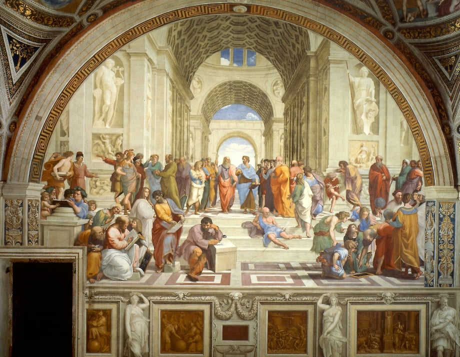

<h1 align="center">Lucas Lopes</h1>

<table width=100%>
  <tr>
    <td width=70%>
      
    </td>
    <td valign="top">
      <h2>About me</h2>
      
I'am a Computer Science student and Software Developer in Brazil.

      
In love with knowledge and constant learning new things

      <h3>Areas of interest</h3>
      <ul>
        <li>Data structures and low-level implementations</li>
        <li>Development of full-stack web application</li>
        <li>Linear algebra and maths</li>
        <li>APIs integration and scalable backend develop</li>
      </ul>
    
Currently studying the quantum cumputing universe

    </td>
  </tr>
</table>

## Tools

- Typescript/Javascript, Python, C, Java
- React, React-Router, NestJS, express, fastify, node, bun
- PostgreSQL, MySQL, Mongodb, Redis, mongoose, prisma
- Docker/Docker-compose, Git
